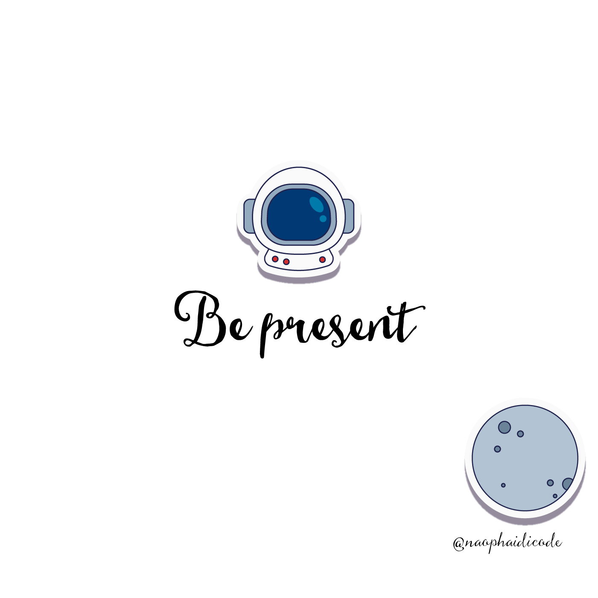

Here are some useful skills to make your job more pleasant and effective. Obviously, communication skills or problem-solving skills are important, but these are a kind of skills that get passed from person to person, unwritten but highly valuable in keeping you on par with the workload, with your colleagues and defining a clear vision on what to do next in order to be trustworthy and reliable. Okie let's go! 🚀

# 1️⃣ Always update your job progress

This is vitally useful in WFH situations because it helps others aware of how much of the task has been done.

For example if you hire a repair team for your house, you would find more relief knowing that they will call and update the progress everyday, rather than just do it silently and you don't know what is going on, what is missing or what is broken.

The business team is the same. They also want to know how the new feature is carried out so they can deal with the partners or plan their next moves. This also makes you feel more responsible for your job because you always have to deliver results to keep up with the pre-defined timeline.

# 2️⃣ Keep a record of your tasks

Keeping a small note of what you have completed, what you have achieved and contributed is definitely not a bad idea when you have to look back on 1001 things you have done in a week/ a month/ a year to say in your next interview.

The questions like "what have you done, what have you learnt, what did you contribute, etc" will require you to compose and pin point the most significant thing you have done in your previous job so that the listener has a solid understanding of your experience.

There would be a point when you have been really into the job, the task that you did, features you built, ideas you suggested, all come as a matter of fact and you don't even notice. Until you get to tell in the next job interview about your job. Then the answer like "I build an app for my company" wouldn't be very much agreeable, ye?

# 3️⃣ How to deal with standups 

Standups are where you present and showcase your work for the last day/ week/ month. We have daily standup, weekly standup, Monday standup, midweek standup and all kinds of the standup sit down is, at the end of the day, to let each other know your work progress.

You only have 1 second to present (that's over exaggerating but you know what I mean) and then come others, so you should highlight the most impactful things you have done throughout the week.

To prepare for standups, we have the second thing above: note your task. When you have a compilation of tasks, you can easily summarize within a few sentences. Don't say too long because humans can only focus for 30 seconds.

In case you work in a startup but your bosses don't have much experience in tech. You can mention the impact of your feature to their business, so instead of saying "I improve our server", say "I improve our server so now our application can handle 1000 users login at the same time"! The latter is more relevant to their revenue and they will recognize your hard work. 

# 4️⃣ Give others credit 

When mentioning others' ideas, and that is in case you need to mention others' ideas, if not let's them speak. Let's begin with "A told me that, B thinks, C suggests, D mentions, etc" and continues.

Credit to others! It shows you care and respect your colleagues and their ideas.

# 5️⃣ Own your work. Take ownership.

This is a very large topic but all in all let's make the work shine with your name. You take responsibility for your work, even when it fails upside down or when it wins with flying colors.

Treat the product, features like your own and you will know what to do. For example what kinds of bottle neck it has, how to write code with best practices, how to write documentation. Also remember to follow it through and through, knowing what is needed for the next MVP, which features should be postponed, what to discuss with Product Designer, protect your and others' intellectual property, etc

# 6️⃣ Be kind

Give more compliments. I always comment "good work" in others' PR, give hurt or support my colleagues when they have nice ideas because I think everyone deserves to be praised and acknowledged. I would want it too, so why hesitate giving others?

Be in your teammate's shoes when commenting on their PRs because they are public and anyone can read it. Be polite and give suggestions "I think you should, I suggest that, how about, etc" rather than commands.

Be kind, say thank you and sorry, support and encourage others are ways to make you shine and feel present at work, would you believe that?

I hope this post could help you enjoy your work more and gain more experience from it. If you have any unwritten rules like this at work, please let me know. Cheers! 🔥