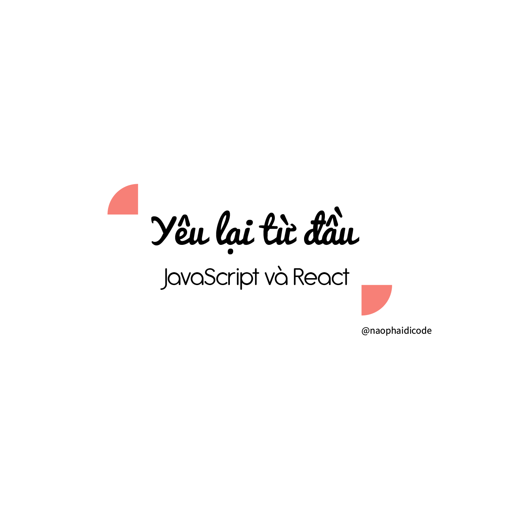

The image was originally designed for the Vietnamese version of the post

Having gone through quite a lot of online materials and online resources, I want to compile them into this post so that if you are new to JavaScript (React) and don't know where to start, this could be a great reference.

Before that....

# 1️⃣ Thanks God I bought O'Reilly subscription

I have known about O'Reilly books before but I was broke to buy its subscription 😭 There are very few O'Reilly books that have free pdf online. Those who do have free pdf files turn out to be pretty low in quality (the author addresses the topic very shallowly) or pretty old (the older version of the programming language I want to learn).

So after going through those poor books, I hastily draw to the conclusion that reading books is not my go-to way when learning programming, so I switch to video courses, w3s or reading short articles. Lately, when I finally decided to buy an O'Reilly subscription, and after going through the most recent edition of the most popular authors, I surprisingly realized that this is love!

It's absolutely worth it when you pay for the high quality material, not only it's a smart investment but it's also a legit way to test the suitability of you and that learning method. So with anyone who intends to follow this career seriously, I suggest you nurture your brain with quality resources.

Some cool features of O'Reilly subscription: 🧨

- you have access to high quality books that are often revised, edited and updated.

- the numbers of books are vast and you can almost any topic there

- you have the rights to enter live online training (from 2 to 4 hours in 1 or 2 days) from the authors. To those who are self-taught like me, attending those trainings is very similar to attending classes at university, where you are free to ask questions and work on the same projects alongside the instructors.

📌 The O'Reilly link for anyone who needs it

https://www.oreilly.com/online-learning/pricing.html

# 2️⃣ Pick the right book

Some titles for those who want to learn/ revise JavaScript that I have read and claimed that it's super cool:

### 📌 JavaScript The Definitive Guide by David Flanagan

The book teaches JS from start to end, from basic syntax to the language's properties and more advanced concepts, etc.

Suitable for those who want to learn JS carefully from the very beginning.

### 📌 Modern JavaScript for the Impatient By Cay S. Horstmann

A brief and to-the-point book (well, for the impatient) that helps you revise JS in no time!

### 📌 You don't know JS

A book that goes deeper into the language nuances for those who have learnt about it but want to dive a bit deeper. The author spends a good amount of time explaining the way how JS works.

https://github.com/.../You-Dont.../blob/1st-ed/README.md

### 📌 JavaScript Cookbook 2nd edition by Shelly Powers 

The JS recipes for those who have a fundamental understanding of the language but still don't know how to apply it in your projects. The author targets subjects like array, object, function, api, etc with topics like creating unique key-value pairs, validating form data, etc. It's especially useful when doing side projects because you might encounter the same problem again and again (like authentication, login, handling data, etc) and they are all in this book.

### 📌 Learning React, 2nd Edition By Eve Porcello and Alex Banks

I highly recommend this book for learning React. This book teaches basic React and how to use hooks in functional components, not class components anymore. Besides, it covers topics like incorporating data, react-router, server, etc.

### 📌 React Projects by Roy Derks

This is a compilation of real-life React projects from shopping list, e-commerce site to PWA or a small game, from building projects from scratch to using create-react-app. I can guarantee that this helps you advance your React skills because you already have in mind how to implement some of the most popular React projects.

⇒ The most effective way to digest this book is reading and copying code, commenting and explaining it to yourself in your own way so that you can understand it carefully. It might be time-consuming at first, but once you get used to it, it would be like a breeze!

# 3️⃣ Udemy courses for coding marathon and getting certificates

You can also purchase Udemy courses to learn how experienced developers organize their projects from start to end.

You can even code alongside them to train your thoughts and code writing skills. And the most important is the certificates to add to your resume, worth every penny!

Some courses I have learnt and highly recommend:

### 📌 https://www.udemy.com/course/the-complete-javascript-course/

### 📌 https://www.udemy.com/.../react-the-complete-guide-incl.../

# 4️⃣ Let's save W3S for reference

w3s or developer.mozilla are just dictionaries to help you double check on syntax. They shouldn't be your starting materials because they are brief and you can only understand the surface, the formula but not exactly how it works. Well you don't learn a new language by reading a dictionary right?!

So my advice is to save it for reference. Let's just go with books or online courses guys

# 5️⃣ Jump to Medium only when you have a solid base

Medium has tons of great articles, I agree. But the thing is they are all written on the mindset that you already KNOW the language. Next is not every article is written by someone who is experienced or someone who is good at explaining things.

So I put Medium last for when you have a solid base or you want to grasp a topic on-the-go. It's also a nice way to update yourself with more informative topics.

I hope with this compilation you have a clearer vision of how to approach JavaScript and how to grow further. I understand that it's hard but once you have the right materials you have already solved 50% of the problem.

I also have a tatter journey with JavaScript, with trials and errors so I make this post, hoping you have an easier journey <3 Cheers! 🔥