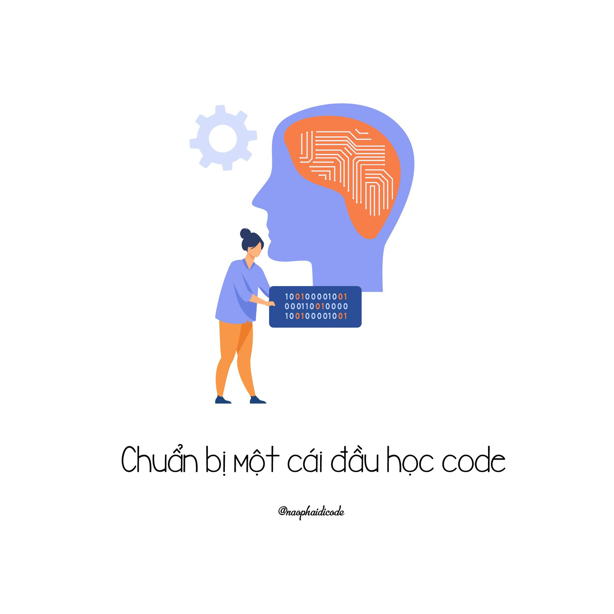

The image was originally designed for the Vietnamese version of the post

# I also started differently

At the very beginning, this blog's aim has always been to inspire and encourage anyone who switches careers and self-teaches themselves software development, just like 'meself' when I first started. I understand the frustration and exhaustion when you turn into a different career path, which doesn't like anything you have known. Some of you don't even have a degree, not knowing if you can make it or if anyone can make it. 🤷‍♀️

One thing for certain is I didn't just jump into learning programming on day 1. But I spend some time getting myself acquainted with logical questions, problem solvings, math, etc. I train my brain to adapt to the environment of coding, when you have to think fast and think clearly.

Looking back, I could never imagine I have made it this far. Even though I'm not at the very high peak of my career, I still consider every small achievement along the way a huge leap from the start line.

# Career switcher this and career switcher that

Let's talk about the translatable skills when you switch careers. For example if you come to programming from a B.S. degree (Bachelor of Sciences) then you might already have some encounters with problems similar to coding, compared to someone from B.A. field (like me).

Those folks who jump into programming from B.A. field should prep your brain for coding, say to adapt your logical and critical thinking to a more programmatic fashion, leaning towards numbers and figures. In social problems, we have true - false - and something in between, but in coding, we only have true OR false. Things are more strict and rigid that way. 

# 3 things to make a smoother programming journey

There are 3 things you can do/ should do to make your learning journey become smoother:

## 1️⃣ Train your thought to be fast and precise
Thinking fast is one thing, but thinking precisely is more important. In literature analysis, you can imagine and assume a character's action, but a computer's action is predictable. You feed a wrong value, the program stops working. Therefore it's important to look into facts rather than to feel that it may be right.

### => Solving Sudoku
Sudoku is when you train your deductive thinking. If 3 goes to row A, then 5 will go to row F, but 5 cannot go to row F because F already has 5. So 5 can only go to A. Or if 2 is in this column, it cannot be in other columns. So we left with 3, 6, 8. But we already have 3, 6, 8 here, so that number cannot be 2.

That hurts your brain, but it expands your memory storage and helps you truly focus on the fact, data you have been given.

Where? Sudoku books or mobile app

### => Solving math problems
More about inductive and deductive reasoning like finding the next pattern or the missing piece in a picture. Deductive is more detective-like. If Mary goes before Anna but Anna goes right after John then what would be the correct order?

I have trained for the SAT exam. And thanks to that I have a few months constantly solving SAT math problems that are more about critical thinking. So when I come to programming, my thinking becomes faster and more logical.

Where? Khan Academy or Talent Central. This site has several mind tests but they only let you know the result, not the solution, so it's quite inconvenient when you don't know why you get it wrong.

## 2️⃣ Get familiar with using pattern in programming

Patterns are fundamental in programming. They are models that are approved and repeated more often that each of them gets a distinct name and usage.

But why do we need patterns in programming? Let's take a cookie example. If every household keeps a secret to their cookie recipe, every cookie batch will be different. In society, this is good in reserving uniqueness, but in programming this practice makes it hard to maintain consistency, while consistency is key in software development!

So before you even apply patterns in your code, you have to realize how important they are. If not, you just write code so that they run without errors and also without rules.

## 3️⃣ Practice good coding conventions by copy-pasting good coding conventions.

At the beginning of your learning, it's hard to know how to write good code. So you should watch and learn, copy the way others write code. Let's copy! From stackoverflow, dev.to, medium, github issue, and also those tutorials you see online.

Eventually you start to recognize a good coding convention from a bad one, together with the Clean Code rules as your compass. Then you can write code with best practices. But remember do not reinvent the wheel! If somebody solves a problem gracefully, learn and follow them rather than try to beat them just because you don't accept their solution is better than your own.

Okie so in sum there are 3 things to do to make a good start in programming:

🌱 prep your thinking: fast/ concise/ precise

🌱 be familiar with using patterns

🌱 follow good coding conventions

Hope that this post has proved useful to you. Please stay tuned for more. Cheers! 🔥